# Light Status Simulator Coding Challenge

A C++ software project to interact with the [Josh.ai LightSimulator](https://github.com/jstarllc/JoshCodingChallenge/releases/tag/v1.0) via API, demonstrating integration and control logic. Developed using CLion 2025.2 on Windows 11.

---

**====================================================================================================================**

---

## Authors

- Cory Jaramillo - cory.jaramillo8@gmail.com

---

**====================================================================================================================**

---

## Prerequisites

- [ ]  Windows 11 OS
- [ ]  CMake 3.31 or greater
- [ ]  CLion 2024 or greater
- [ ]  MinGW compiler 11.0w64 or greater (also comes bundled with CLion)
- [ ]  Git (recommended for cloning the repository)
- [ ]  [Josh.ai LightSimulator](https://github.com/jstarllc/JoshCodingChallenge/releases/tag/v1.0) executable for Windows

---

**====================================================================================================================**

---

## Run Locally

1. [ ]  Clone the repository:

```bash
git clone --branch code_challenge_dev https://github.com/coryjaramillo/cj_lightstatussim_code_challenge.git
cd cj_lightstatussim_code_challenge
```
2. [ ]  Download the [Josh.ai LightSimulator](https://github.com/jstarllc/JoshCodingChallenge/releases/tag/v1.0) for Windows.
3. [ ]  Extract and launch the LightSimulator executable.
4. [ ]  Open CLion.
5. [ ]  Go to `File > Open` and select the root project folder: "/cj_lightstatussim_code_challenge".

---

**====================================================================================================================**

---

## CLion Build Instructions

1. [ ]  Open the project in CLion.
2. [ ]  In CLion, navigate to `File > Settings > Build, Execution, Deployment > CMake`.
2. [ ]  Add these four CMake build profiles:
- [ ]  `Debug_Simple`
    - [ ]  `Name: Debug_Simple`
    - [ ]  `Build type: Debug_Simple`
    - [ ]  `Leave all other profile settings to default`
- [ ]  `Debug_Verbose`
    - [ ]  `Name: Debug_Verbose`
    - [ ]  `Build type: Debug_Verbose`
    - [ ]  `Leave all other profile settings to default`
- [ ]  `Debug_All`
    - [ ]  `Name: Debug_All`
    - [ ]  `Build type: Debug_All`
    - [ ]  `Leave all other profile settings to default`
- [ ]  `Release`
    - [ ]  `Name: Release`
    - [ ]  `Build type: Release`
    - [ ]  `Leave all other profile settings to default`
3. [ ]  Click Apply.
4. [ ]  Click OK.
5. [ ]  Set your active build profile in the CLion top-right dropdown.
6. [ ]  Click **Build** to build the project for the currently selected profile.

---

**====================================================================================================================**

---

## Usage/Examples

- Ensure the LightSimulator.exe is running.

- When started, it will open a terminal window waiting for a connection confirmation.

- Open your web browser and go to http://localhost:8080 to confirm the LightSimulator is ready.

- With the simulator active, in CLion select your desired build profile and run the project.

- Interactions can now occur via the browser UI connected to the simulator.

- At this point, you should see initial output in the CLion terminal when you run the application.

---

**====================================================================================================================**

---

## Testing

---

### Test Setup
- [ ]  [Verify LightSimulator Executable Setup](#lightsimulator-executable-setup)
- [ ]  [Verify Light Simulator Browser Setup](#light-simulator-browser-setup)
  _If you start the browser before the executale, you will need to refresh the browser to connect to the executable._
- [ ]  [Verify Code Challenge Execution](#code-challenge-execution)
- [ ]  [Option 1](#option-1)
-    _OR_
- [ ]  [Option 2](#option-2)

---

#### LightSimulator Executable Setup
- [ ]  Open File Explorer.
- [ ]  Locate LightSimulator folder on your system.
- [ ]  Launch LightSimulator_windows_amd64.exe.  
  _If you do not have the LightSimulator downloaded, see the [Run Locally](#run-locally) section for download and installation steps._
- [ ]  Validate the LightSimulator is running by locating an open terminal window with at least the following at the beginning of the output:
  ```sh
   [GIN-debug] [WARNING] Creating an Engine instance with the Logger and Recovery middleware already attached.
   
   [GIN-debug] [WARNING] Running in "debug" mode. Switch to "release" mode in production.
    - using env:   export GIN_MODE=release
    - using code:  gin.SetMode(gin.ReleaseMode)
   
   [GIN-debug] GET    /static/*filepath         --> github.com/gin-gonic/gin.(*RouterGroup).createStaticHandler.func1 (4 handlers)
   [GIN-debug] HEAD   /static/*filepath         --> github.com/gin-gonic/gin.(*RouterGroup).createStaticHandler.func1 (4 handlers)
   [GIN-debug] GET    /lights                   --> main.GetLights (4 handlers)
   [GIN-debug] GET    /lights/:id               --> main.GetLightByID (4 handlers)
   [GIN-debug] POST   /lights                   --> main.AddLight (4 handlers)
   [GIN-debug] DELETE /lights/:id               --> main.DeleteLightByID (4 handlers)
   [GIN-debug] PUT    /lights/:id               --> main.UpdateLightByID (4 handlers)
   [GIN-debug] GET    /                         --> main.main.func1 (4 handlers)
   [GIN-debug] [WARNING] You trusted all proxies, this is NOT safe. We recommend you to set a value.
   Please check https://pkg.go.dev/github.com/gin-gonic/gin#readme-don-t-trust-all-proxies for details.
   [GIN-debug] Listening and serving HTTP on :8080
  ```

---

#### Light Simulator Browser Setup
- [ ]  Open your browser.
- [ ]  Go to http://localhost:8080.
- [ ]  Verify the simulator is running and ready.

---

#### Code Challenge Execution
##### Option #1
- [ ]  Open the project in CLion.
- [ ]  Verify that CLion is configured with the 4 needed build profiles
  - [ ] `cmake-build-debug-simple`
  - [ ] `cmake-build-debug-verbose`
  - [ ] `cmake-build-debug-all`
  - [ ] `cmake-build-release`
###### _If you do not have all 4 of the above build profiles, see [CLion Build Instructions](#clion-build-instructions) for build setup._
- [ ]  Select your desired build profile.
- [ ]  Build and run your project from CLion so it's active and able to interact with the simulator.

##### Option #2
- [ ]  Open File Explorer.
- [ ]  Navigate to the desired build folder.
- [ ]  Run the build's executable.
- [ ]  Verify the executable is running by locating the terminal pop-up window.

---

#### Obtain lights and their states
_Steps to execute commands in the Light Simulator Browser interface to obtain light info. All steps below are performed in the simulator UI._
- [ ]  Verify that the Light Simulator Browser is running.
    - _If is it not running, reference [LightSimulator Executable](#lightsimulator-executable-setup) and [Light Simulator Browser](#light-simulator-browser-setup)._
- [ ]  Click "Get all lights" button.
- 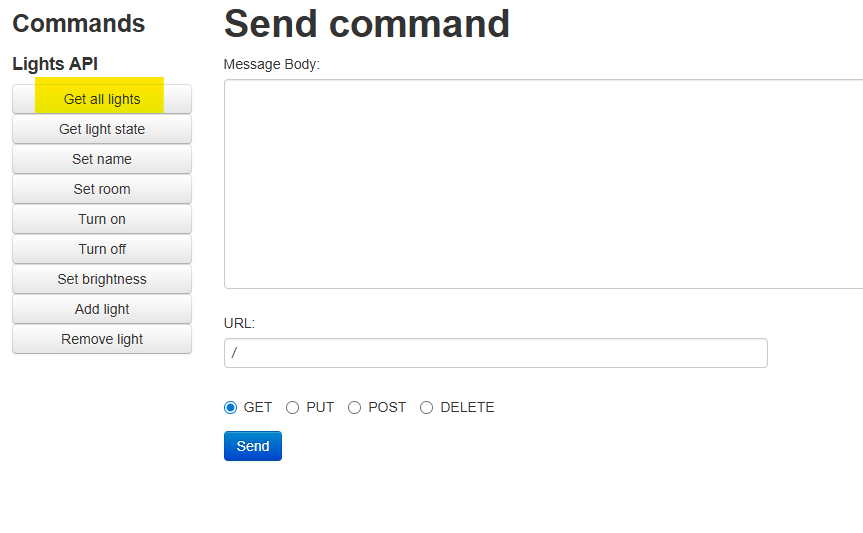
- [ ]  Click "Send".
- 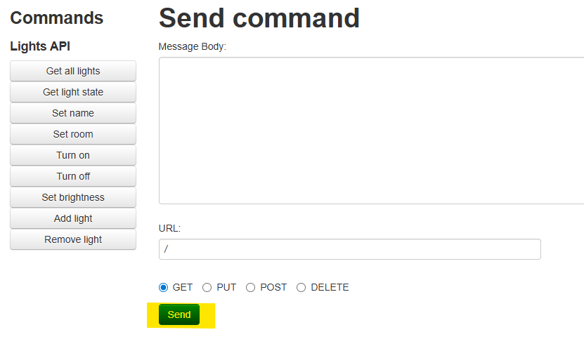
- [ ]  Copy the "id" value of any light.
- 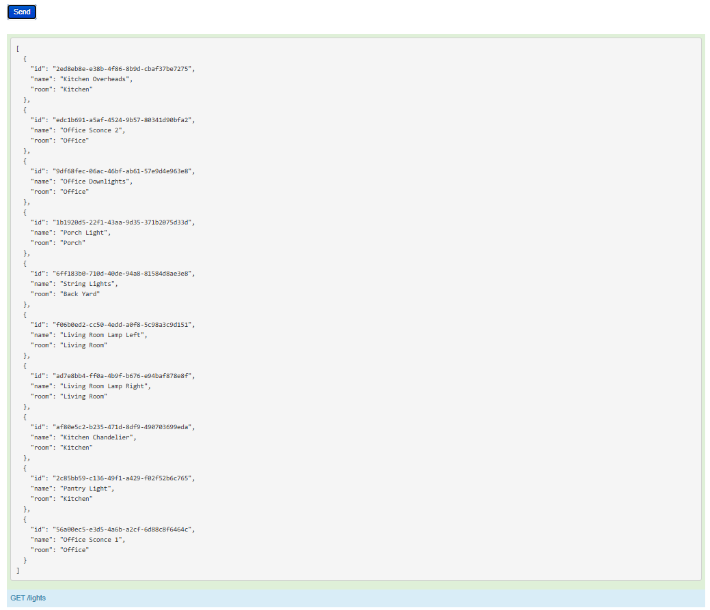
- [ ]  Click "Get light state".
- 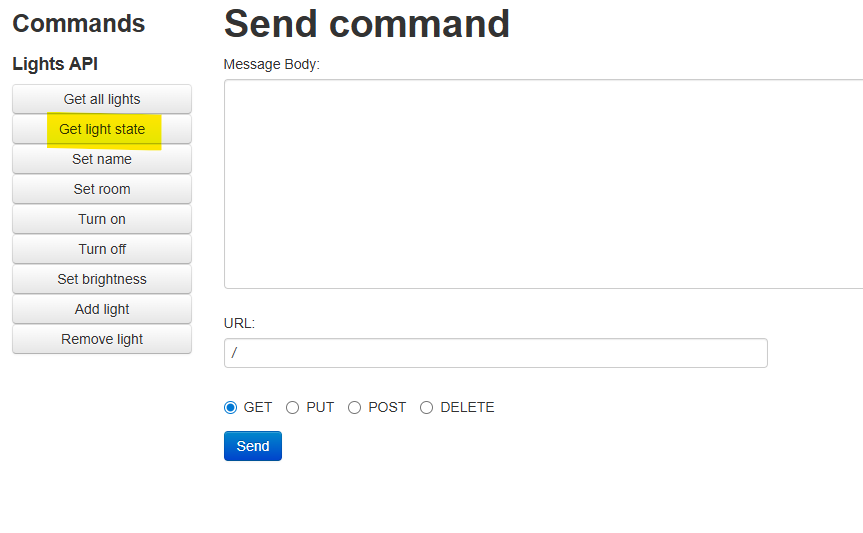
- [ ]  Paste the copied value in place of "<id>" on the URL line. See example below.
```http request
/lights/9df68fec-06ac-46bf-ab61-57e9d4e963e8
```
- 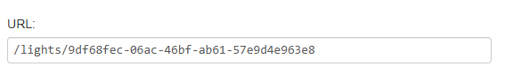
- [ ]  Click "Send".
- 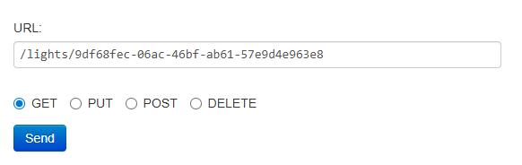
- [ ]  Verify that the output in the Light Simulator Browser interface looks like below.
```json
{
  "id": "9df68fec-06ac-46bf-ab61-57e9d4e963e8",
  "name": "Office Downlights",
  "room": "Office",
  "on": true,
  "brightness": 114
}
```
- 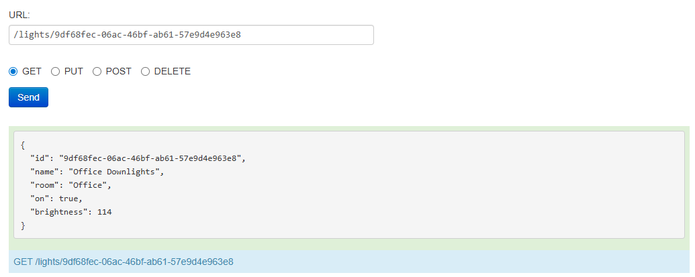

---

### Test 1: Get All Light States
_Get all existing lights and their states._
##### Starting the [Code Challenge](#code-challenge-execution) Application will automatically output the light states.
#### EXPECTED RESULT:
- [ ]  _Verify that your Code Challenge Execution is displaying at least the following output:_
- 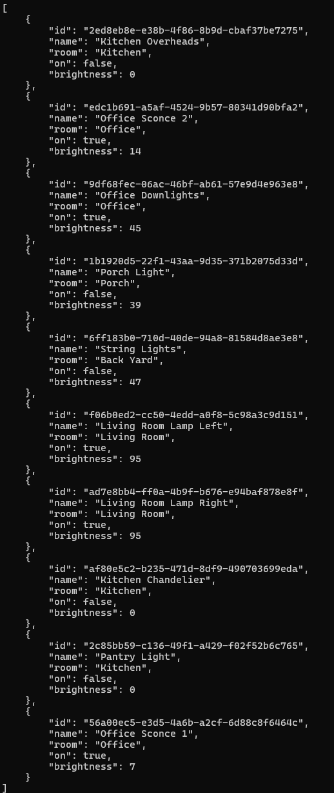

---

### Test 2: Turn the Light OFF
_Turn off any light in the light system._
- [ ]  Repeat the steps in [Obtain Lights and their states](#obtain-lights-and-their-states) to get a light ID.
- [ ]  In the simulator UI, Click "Turn off".
- 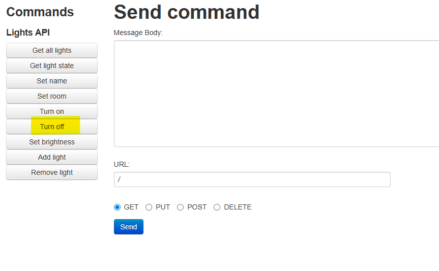
- [ ]  Paste the copied value in place of "<id>" on the URL line. See example below.
```http request
/lights/9df68fec-06ac-46bf-ab61-57e9d4e963e8
```
- 
- [ ]  In the simulator UI, click "Send".
- 
#### EXPECTED RESULTS:
- [ ]  Verify that the simulator reflects the light as OFF (false). See example below.
```json
{
  "id": "9df68fec-06ac-46bf-ab61-57e9d4e963e8",
  "name": "Office Downlights",
  "room": "Office",
  "on": false,
  "brightness": 114
}
```
- 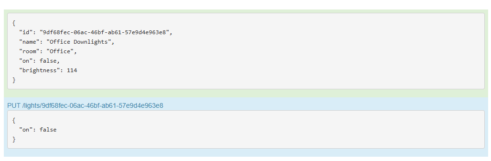
- [ ]  Check that your application terminal correctly updates and displays the new state.
```json
{
   "id": "9df68fec-06ac-46bf-ab61-57e9d4e963e8",
   "on": false
}
```
- 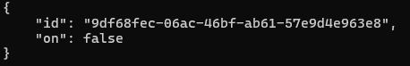

---

### Test 3: Turn the Light ON
_Turn on any light in the light system._
- [ ]  Repeat the steps in [Obtain Lights and their states](#obtain-lights-and-their-states) to get a light ID.
- [ ]  In the simulator UI, Click "Turn on".
- 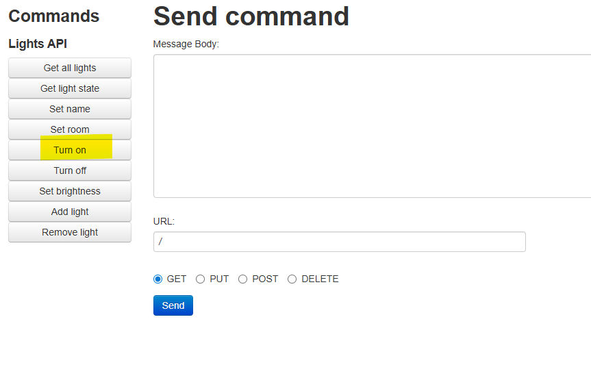
- [ ]  Paste the copied value in place of "<id>" on the URL line. See example below.
```http request
/lights/9df68fec-06ac-46bf-ab61-57e9d4e963e8
```
- 
- [ ]  In the simulator UI, click "Send".
- 
#### EXPECTED RESULTS:
- [ ]  Verify that the simulator reflects the light as ON (true). See example below.
```json
{
   "id": "9df68fec-06ac-46bf-ab61-57e9d4e963e8",
   "name": "Office Downlights",
   "room": "Office",
   "on": true,
   "brightness": 114
}
```
- 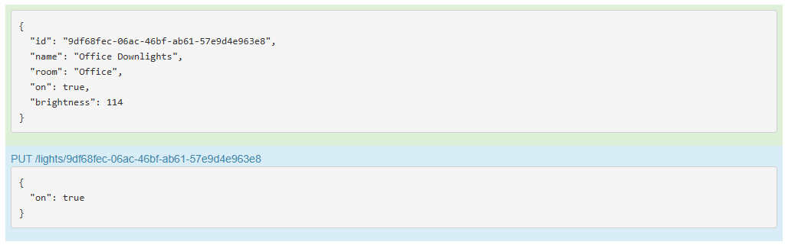
- [ ]  Check that your application terminal correctly updates and displays the new state.
```json
{
   "id": "9df68fec-06ac-46bf-ab61-57e9d4e963e8",
   "on": true
}
```
- 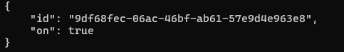

---

### Test 4: Change Light Name
_Change the name of a current, existing light._
- [ ]  Repeat the steps in [Obtain Lights and their states](#obtain-lights-and-their-states) to get a light ID.
- [ ]  In the simulator UI, Click "Set name".
- 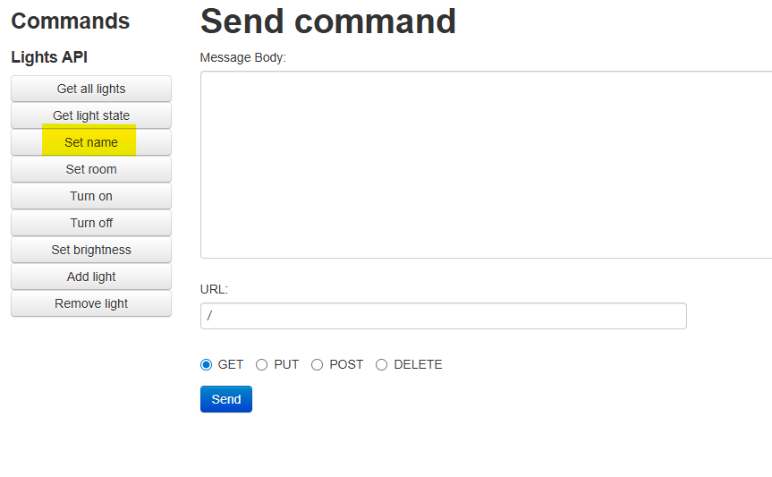
- [ ]  Paste the copied value in place of "<id>" on the URL line. See example below.
```http request
/lights/9df68fec-06ac-46bf-ab61-57e9d4e963e8
```
- 
- [ ]  In the simulator UI, replace "new name" with "Office Desk Light" in the "Message Body".
- 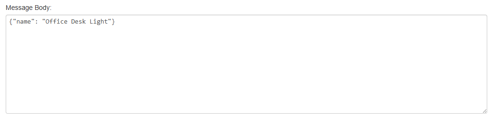
- [ ]  In the simulator UI, click "Send".
- 
#### EXPECTED RESULTS:
- [ ]  Verify that the simulator reflects the light name as "Office Desk Light". See example below.
```json
{
   "id": "9df68fec-06ac-46bf-ab61-57e9d4e963e8",
   "name": "Office Desk Light",
   "room": "Office",
   "on": true,
   "brightness": 114
}
```
- 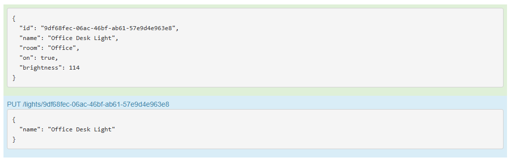
- [ ]  Check that your application terminal correctly updates and displays the new state.
```json
{
   "id": "9df68fec-06ac-46bf-ab61-57e9d4e963e8",
   "name": "Office Desk Light"
}
```
- 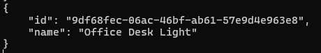

---

### Test 5: Change Light Room
_Change the room location of the light._
- [ ]  Repeat the steps in [Obtain Lights and their states](#obtain-lights-and-their-states) to get a light ID.
- [ ]  In the simulator UI, Click "Set room".
- 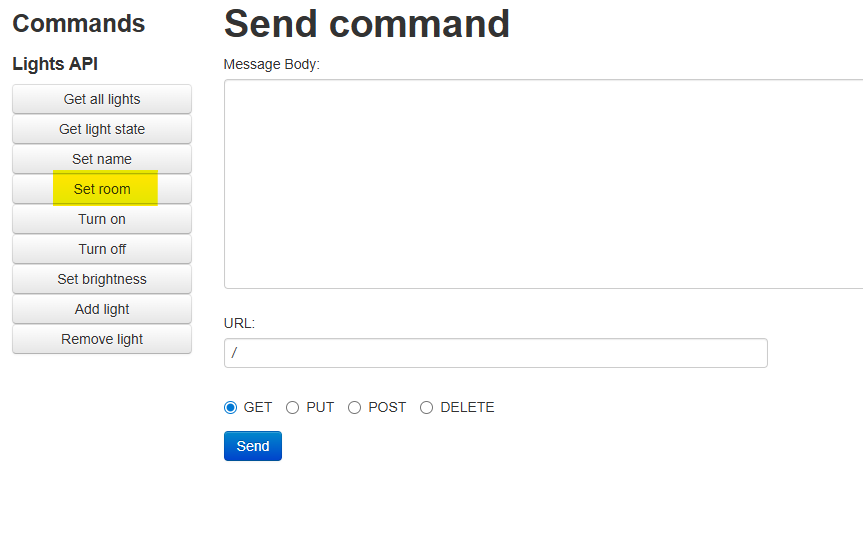
- [ ]  Paste the copied value in place of "<id>" on the URL line. See example below.
```http request
/lights/9df68fec-06ac-46bf-ab61-57e9d4e963e8
```
- 
- [ ]  In the simulator UI, replace "new room" with "Main Office" in the "Message Body".
- 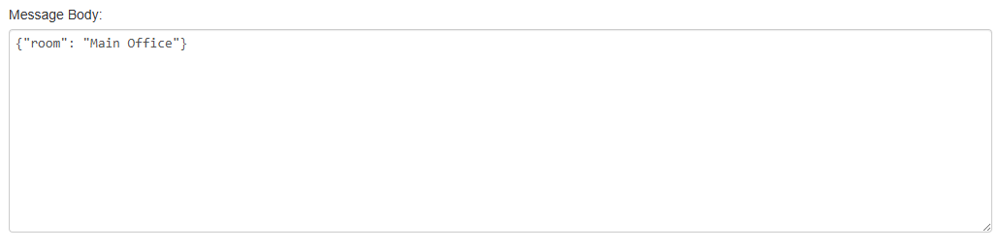
- [ ]  In the simulator UI, click "Send".
- - 
#### EXPECTED RESULTS:
- [ ]  Verify that the simulator reflects the light room as "Main Office". See example below.
```json
{
   "id": "9df68fec-06ac-46bf-ab61-57e9d4e963e8",
   "name": "Office Desk Light",
   "room": "Main Office",
   "on": true,
   "brightness": 114
}
```
- 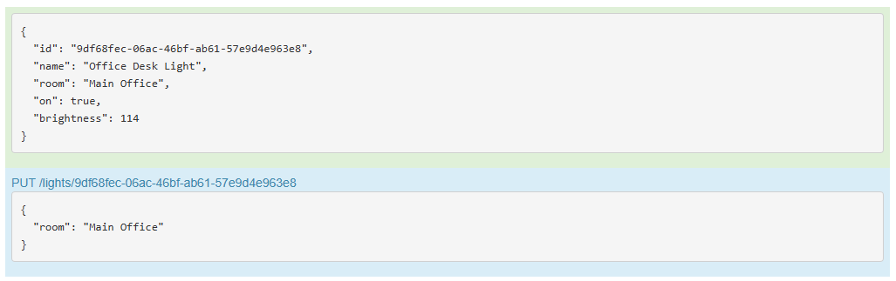
- [ ]  Check that your application terminal correctly updates and displays the new state.
```json
{
   "id": "9df68fec-06ac-46bf-ab61-57e9d4e963e8",
   "name": "Office Desk Light"
}
```
- 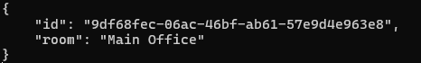

---

### Test 6: Change Light Brightness
_Change the brightness of the light._
- [ ]  Repeat the steps in [Obtain Lights and their states](#obtain-lights-and-their-states) to get a light ID.
- [ ]  In the simulator UI, Click "Set brightness".
- 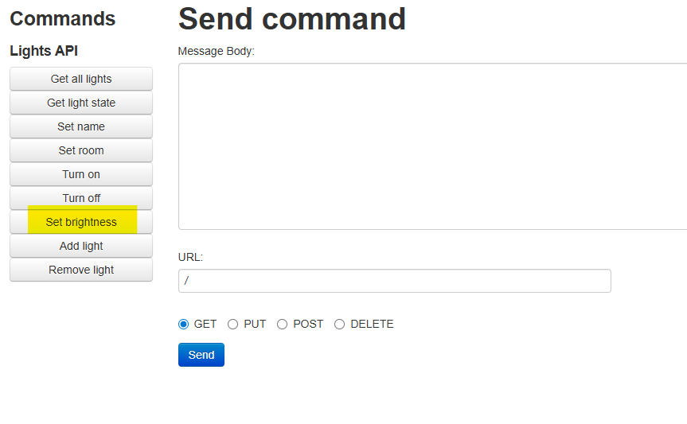
- [ ]  Paste the copied value in place of "<id>" on the URL line. See example below.
```http request
/lights/9df68fec-06ac-46bf-ab61-57e9d4e963e8
```
- 
- [ ]  In the simulator UI, replace brightness value with an integer from 0 to 255 in the "Message Body".
- 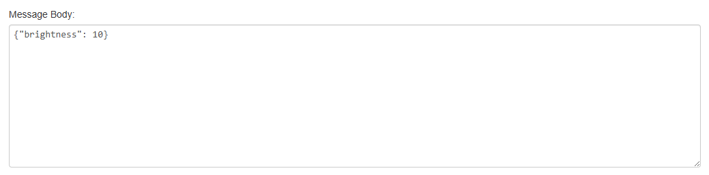
- [ ]  In the simulator UI, click "Send".
- 
- [ ]  Repeat the value change at least 3 times. I did 10, 255, and 78.
- 
- 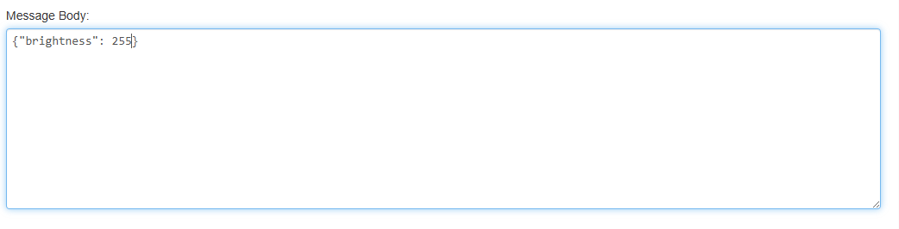
- 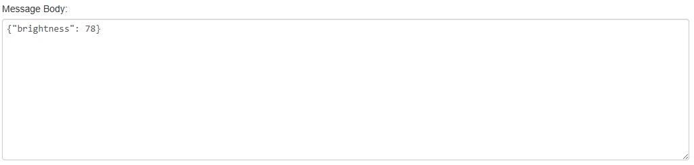
#### EXPECTED RESULTS:
- [ ]  Verify that the simulator reflects the "brightness" as your entered value. See example below.
- 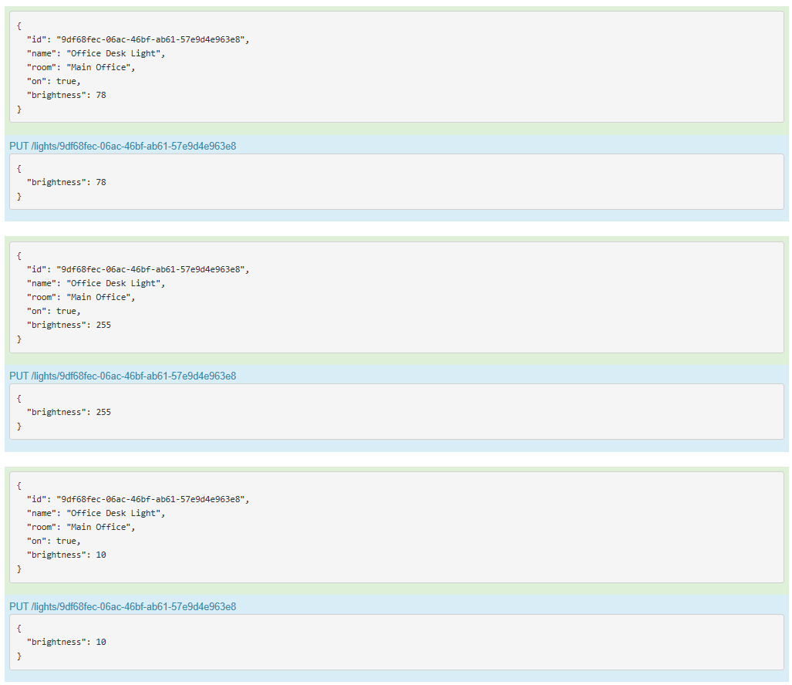
- [ ]  Check that your application correctly updates and displays the new state for each change.
##### _NOTE: Terminal output will show the values in human readable percentage of brightness._
##### _Convert 0-255 to Percentage Equation: percentage = value / 255, then round to the nearest whole number._
```json
[
   {
      "id": "9df68fec-06ac-46bf-ab61-57e9d4e963e8",
      "brightness": 4
   },
   {
      "id": "9df68fec-06ac-46bf-ab61-57e9d4e963e8",
      "brightness": 100
   },
   {
      "id": "9df68fec-06ac-46bf-ab61-57e9d4e963e8",
      "brightness": 31
   }
]
```
- 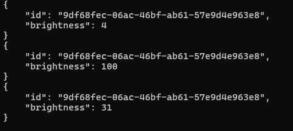

---

### Test 7: Add New Lights
_Add 2 new lights to the house._
- [ ]  In the simulator UI, Click "Add light".
- 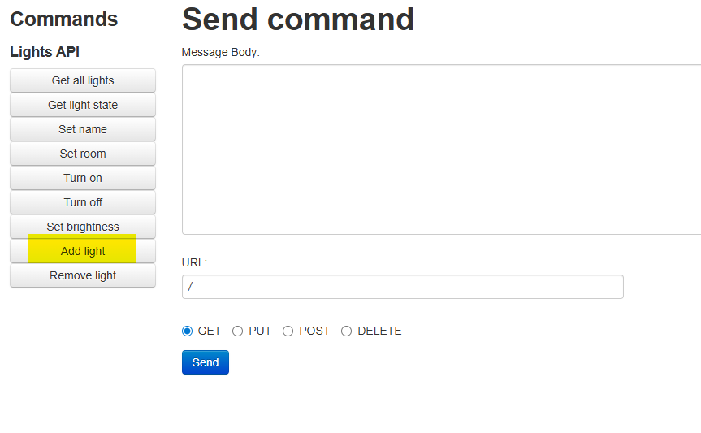
- [ ]  In the simulator UI, copy the json below and pasting into the "Message Body", replacing all contents.
```json
{
    "name": "Bedside Lamp",
    "room": "Guest Bedroom",
    "on": true,
    "brightness": 200
}
```
- 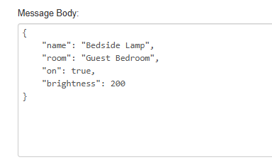
- [ ]  In the simulator UI, click "Send".
- 
- [ ]  Add a second light by copy the json below and pasting into the "Message Body", replacing all contents again.
```json
{
    "name": "Garage Overhead",
    "room": "Garage",
    "on": true,
    "brightness": 255
}
```
- 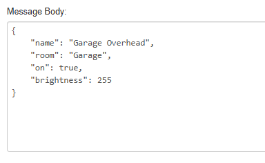
- [ ]  In the simulator UI, click "Send" again.
- 
#### EXPECTED RESULTS:
- [ ]  Verify that the simulator reflects the two new lights. See example below.
##### NOTE: Light ID's may vary.
```json
[
  {
    "id": "602ddcef-3f17-440a-8647-2e2bf2480ff7",
    "name": "Bedside Lamp",
    "room": "Guest Bedroom",
    "on": true,
    "brightness": 200
  },
  {
    "id": "99896a76-3bb4-451e-b8e9-4cd3771c8751",
    "name": "Garage Overhead",
    "room": "Garage",
    "on": true,
    "brightness": 255
  }
]
```
- 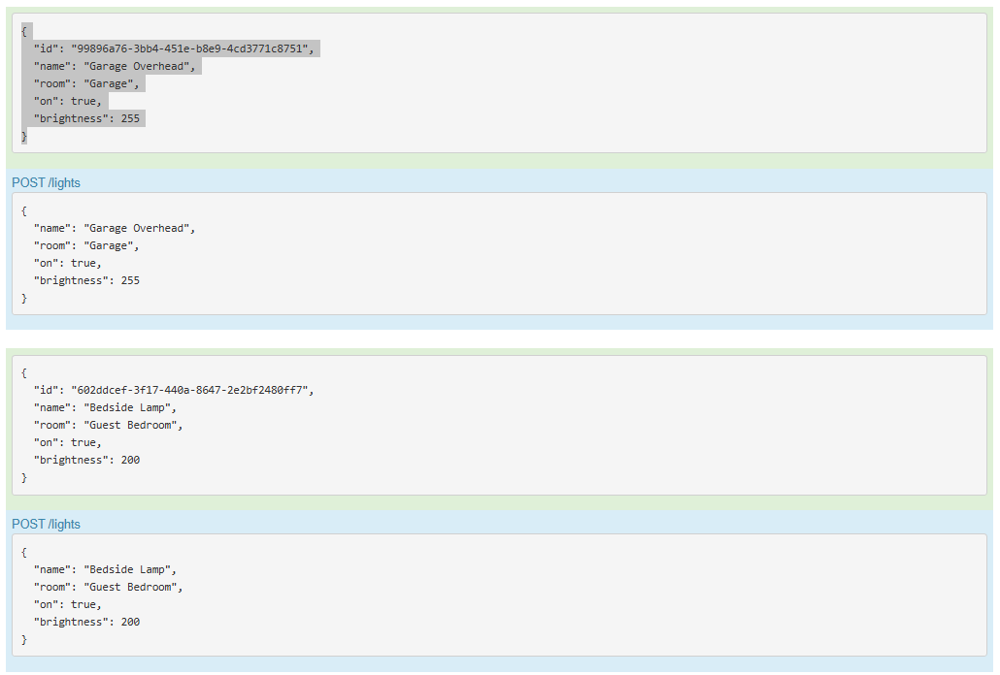
- [ ]  Check that your application terminal correctly updates and displays the new state.
```json
[
  {
    "id": "602ddcef-3f17-440a-8647-2e2bf2480ff7",
    "name": "Bedside Lamp",
    "room": "Guest Bedroom",
    "on": true,
    "brightness": 200
  },
  {
    "id": "99896a76-3bb4-451e-b8e9-4cd3771c8751",
    "name": "Garage Overhead",
    "room": "Garage",
    "on": true,
    "brightness": 255
  }
]
```
- 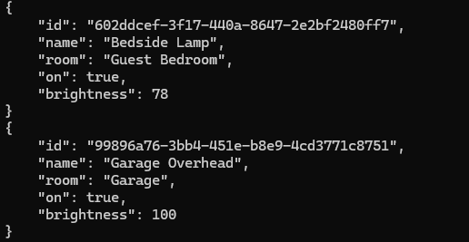

---

### Test 8: Bulk Light Info Change 1
_Change the name and on/off status of a light._
- [ ]  In the simulator UI, Click "PUT".
- 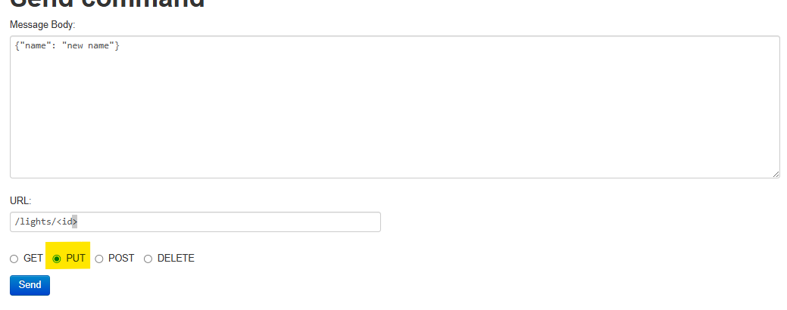
- [ ]  Paste the copied value in place of "<id>" on the URL line. See example below.
```http request
/lights/9df68fec-06ac-46bf-ab61-57e9d4e963e8
```
- 
- [ ]  In the simulator UI, copy the json below and pasting into the "Message Body", replacing all contents.
```json
{
   "name": "Office Under-Shelf",
   "on": false
}
```
- 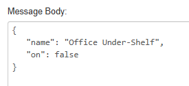
- [ ]  In the simulator UI, click "Send".
- - 
#### EXPECTED RESULTS:
- [ ]  Verify that the simulator reflects the changes to the light. See example below.
```json
{
   "id": "9df68fec-06ac-46bf-ab61-57e9d4e963e8",
   "name": "Office Under-Shelf",
   "room": "Office",
   "on": false,
   "brightness": 114
}
```
- 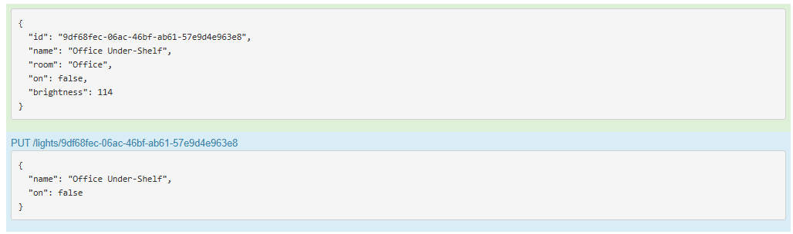
- [ ]  Check that your application terminal correctly updates and displays the new state.
```json
[
  {
    "id": "9df68fec-06ac-46bf-ab61-57e9d4e963e8",
    "on": false
  },
  {
    "id": "9df68fec-06ac-46bf-ab61-57e9d4e963e8",
    "name": "Office Under-Shelf"
  }
]
```
- 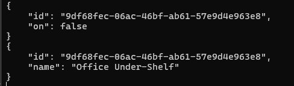

---

### Test 9: Bulk Light Info Change 2
_Change the name and room of a light._
- [ ]  In the simulator UI, Click "PUT".
- 
- [ ]  Paste the copied value in place of "<id>" on the URL line. See example below.
```http request
/lights/9df68fec-06ac-46bf-ab61-57e9d4e963e8
```
- 
- [ ]  In the simulator UI, copy the json below and pasting into the "Message Body", replacing all contents.
```json
{
  "name": "Chandelier",
  "room": "Dining"
}
```
- 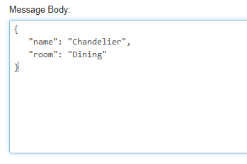
- [ ]  In the simulator UI, click "Send".
- - 
#### EXPECTED RESULTS:
- [ ]  Verify that the simulator reflects the changes to the light. See example below.
```json
{
  "id": "9df68fec-06ac-46bf-ab61-57e9d4e963e8",
  "name": "Chandelier",
  "room": "Dining",
  "on": false,
  "brightness": 114
}
```
- 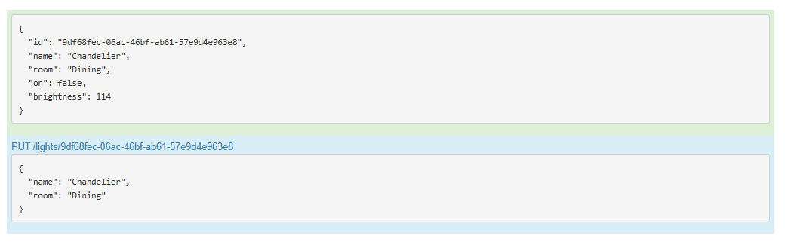
- [ ]  Check that your application terminal correctly updates and displays the new state.
```json
[
  {
    "id": "9df68fec-06ac-46bf-ab61-57e9d4e963e8",
    "name": "Chandelier"
  },
  {
    "id": "9df68fec-06ac-46bf-ab61-57e9d4e963e8",
    "room": "Dining"
  }
]
```
- 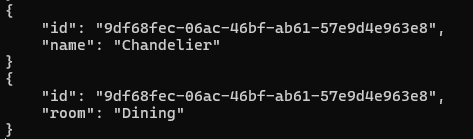

---

### Test 10: Bulk Light Info Change 3
_Change the name and brightness of a light._
- [ ]  In the simulator UI, Click "PUT".
- 
- [ ]  Paste the copied value in place of "<id>" on the URL line. See example below.
```http request
/lights/9df68fec-06ac-46bf-ab61-57e9d4e963e8
```
- 
- [ ]  In the simulator UI, copy the json below and pasting into the "Message Body", replacing all contents.
```json
{
   "name": "Dining Overlight",
   "brightness": 175
}
```
- 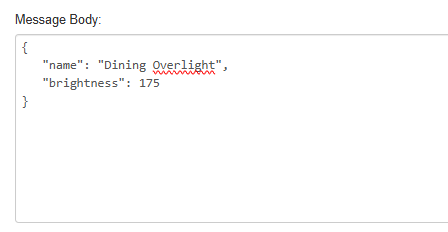
- [ ]  In the simulator UI, click "Send".
- - 
#### EXPECTED RESULTS:
- [ ]  Verify that the simulator reflects the changes to the light. See example below.
```json
{
  "id": "9df68fec-06ac-46bf-ab61-57e9d4e963e8",
  "name": "Dining Overlight",
  "room": "Dining",
  "on": false,
  "brightness": 175
}
```
- 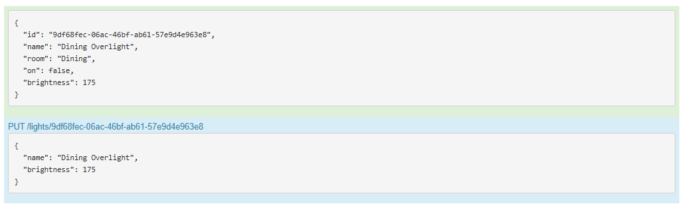
- [ ]  Check that your application terminal correctly updates and displays the new state.
```json
[
  {
    "id": "9df68fec-06ac-46bf-ab61-57e9d4e963e8",
    "brightness": 69
  },
  {
    "id": "9df68fec-06ac-46bf-ab61-57e9d4e963e8",
    "name": "Dining Overlight"
  }
]
```
- 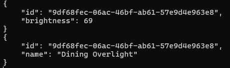

---

### Test 11: Bulk Light Info Change 4
_Change the room and on/off status of a light._
- [ ]  In the simulator UI, Click "PUT".
- 
- [ ]  Paste the copied value in place of "<id>" on the URL line. See example below.
```http request
/lights/9df68fec-06ac-46bf-ab61-57e9d4e963e8
```
- 
- [ ]  In the simulator UI, copy the json below and pasting into the "Message Body", replacing all contents.
```json
{
   "room": "Kitchen",
   "on": true
}
```
- 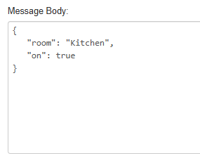
- [ ]  In the simulator UI, click "Send".
- - 
#### EXPECTED RESULTS:
- [ ]  Verify that the simulator reflects the changes to the light. See example below.
```json
{
  "id": "9df68fec-06ac-46bf-ab61-57e9d4e963e8",
  "name": "Dining Overlight",
  "room": "Kitchen",
  "on": true,
  "brightness": 175
}
```
- 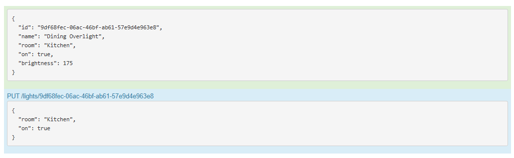
- [ ]  Check that your application terminal correctly updates and displays the new state.
```json
[
  {
    "id": "9df68fec-06ac-46bf-ab61-57e9d4e963e8",
    "on": true
  },
  {
    "id": "9df68fec-06ac-46bf-ab61-57e9d4e963e8",
    "room": "Kitchen"
  }
]
```
- 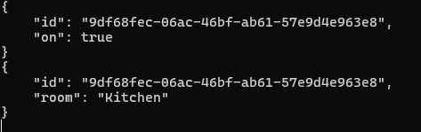

---

### Test 12: Bulk Light Info Change 5
_Change the room and brightness status of a light._
- [ ]  In the simulator UI, Click "PUT".
- 
- [ ]  Paste the copied value in place of "<id>" on the URL line. See example below.
```http request
/lights/9df68fec-06ac-46bf-ab61-57e9d4e963e8
```
- 
- [ ]  In the simulator UI, copy the json below and pasting into the "Message Body", replacing all contents.
```json
{
   "room": "Family Dining",
   "brightness": 225
}
```
- 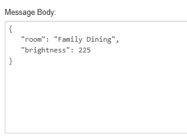
- [ ]  In the simulator UI, click "Send".
- - 
#### EXPECTED RESULTS:
- [ ]  Verify that the simulator reflects the changes to the light. See example below.
```json
{
  "id": "9df68fec-06ac-46bf-ab61-57e9d4e963e8",
  "name": "Dining Overlight",
  "room": "Family Dining",
  "on": true,
  "brightness": 225
}
```
- 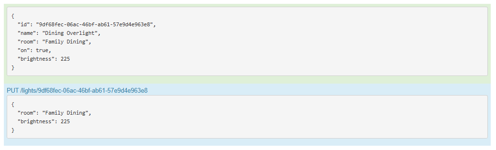
- [ ]  Check that your application terminal correctly updates and displays the new state.
```json
[
  {
    "id": "9df68fec-06ac-46bf-ab61-57e9d4e963e8",
    "room": "Family Dining"
  },
  {
    "id": "9df68fec-06ac-46bf-ab61-57e9d4e963e8",
    "brightness": 88
  }
]
```
- 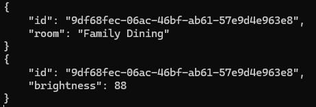

---

### Test 13: Bulk Light Info Change 6
_Change the name, room, and on/off status of a light._
- [ ]  In the simulator UI, Click "PUT".
- 
- [ ]  Paste the copied value in place of "<id>" on the URL line. See example below.
```http request
/lights/9df68fec-06ac-46bf-ab61-57e9d4e963e8
```
- 
- [ ]  In the simulator UI, copy the json below and pasting into the "Message Body", replacing all contents.
```json
{
    "name": "Wall 1 Sconces",
    "room": "Den",
    "on": false
}
```
- 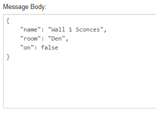
- [ ]  In the simulator UI, click "Send".
- - 
#### EXPECTED RESULTS:
- [ ]  Verify that the simulator reflects the changes to the light. See example below.
```json
{
  "id": "9df68fec-06ac-46bf-ab61-57e9d4e963e8",
  "name": "Wall 1 Sconces",
  "room": "Den",
  "on": false,
  "brightness": 225
}
```
- 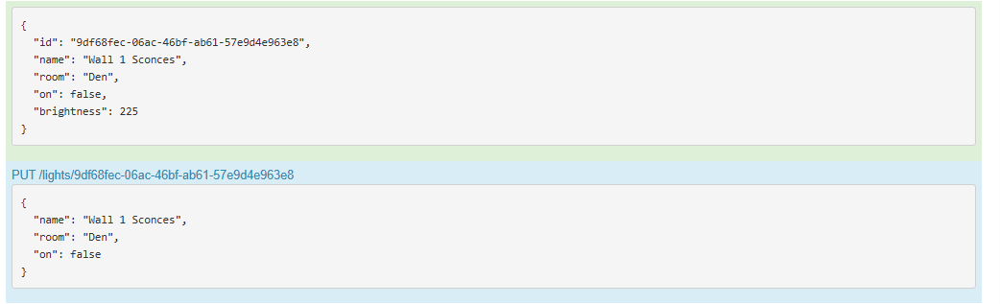
- [ ]  Check that your application terminal correctly updates and displays the new state.
```json
[
  {
    "id": "9df68fec-06ac-46bf-ab61-57e9d4e963e8",
    "on": false
  },
  {
    "id": "9df68fec-06ac-46bf-ab61-57e9d4e963e8",
    "name": "Wall 1 Sconces"
  },
  {
    "id": "9df68fec-06ac-46bf-ab61-57e9d4e963e8",
    "room": "Den"
  }
]
```
- 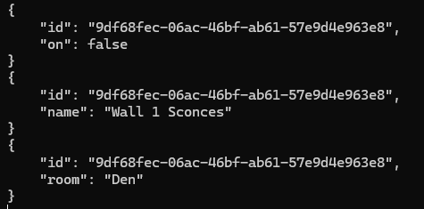

---

### Test 14: Bulk Light Info Change 7
_Change the name, room, and brightness of a light._
- [ ]  In the simulator UI, Click "PUT".
- 
- [ ]  Paste the copied value in place of "<id>" on the URL line. See example below.
```http request
/lights/9df68fec-06ac-46bf-ab61-57e9d4e963e8
```
- 
- [ ]  In the simulator UI, copy the json below and pasting into the "Message Body", replacing all contents.
```json
{
    "name": "Central Chandelier",
    "room": "Foyer",
    "brightness": 200
}
```
- 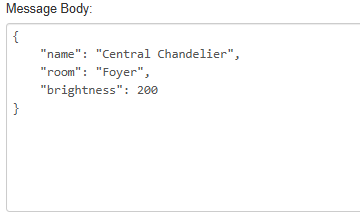
- [ ]  In the simulator UI, click "Send".
- - 
#### EXPECTED RESULTS:
- [ ]  Verify that the simulator reflects the changes to the light. See example below.
```json
{
  "id": "9df68fec-06ac-46bf-ab61-57e9d4e963e8",
  "name": "Central Chandelier",
  "room": "Foyer",
  "on": false,
  "brightness": 200
}
```
- 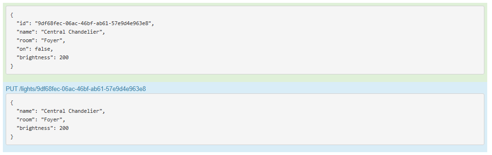
- [ ]  Check that your application terminal correctly updates and displays the new state.
```json
[
  {
    "id": "9df68fec-06ac-46bf-ab61-57e9d4e963e8",
    "name": "Central Chandelier"
  },
  {
    "id": "9df68fec-06ac-46bf-ab61-57e9d4e963e8",
    "room": "Foyer"
  },
  {
    "id": "9df68fec-06ac-46bf-ab61-57e9d4e963e8",
    "brightness": 78
  }
]
```
- 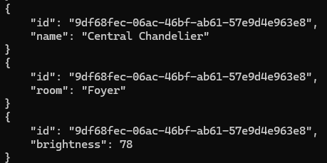

---

### Test 15: Bulk Light Info Change 8
_Change the name, on/off status, and brightness of a light._
- [ ]  In the simulator UI, Click "PUT".
- 
- [ ]  Paste the copied value in place of "<id>" on the URL line. See example below.
```http request
/lights/9df68fec-06ac-46bf-ab61-57e9d4e963e8
```
- 
- [ ]  In the simulator UI, copy the json below and pasting into the "Message Body", replacing all contents.
```json
{
    "name": "Wall Sconces", 
    "on": true, 
    "brightness": 150
}
```
- 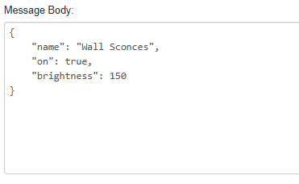
- [ ]  In the simulator UI, click "Send".
- - 
#### EXPECTED RESULTS:
- [ ]  Verify that the simulator reflects the changes to the light. See example below.
```json
{
  "id": "9df68fec-06ac-46bf-ab61-57e9d4e963e8",
  "name": "Wall Sconces",
  "room": "Foyer",
  "on": true,
  "brightness": 150
}
```
- 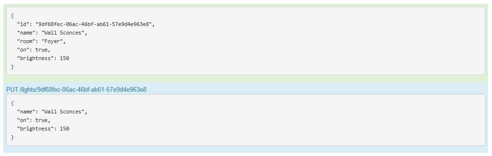
- [ ]  Check that your application terminal correctly updates and displays the new state.
```json
[
  {
    "id": "9df68fec-06ac-46bf-ab61-57e9d4e963e8",
    "name": "Wall Sconces"
  },
  {
    "id": "9df68fec-06ac-46bf-ab61-57e9d4e963e8",
    "on": true
  },
  {
    "id": "9df68fec-06ac-46bf-ab61-57e9d4e963e8",
    "brightness": 59
  }
]
```
- 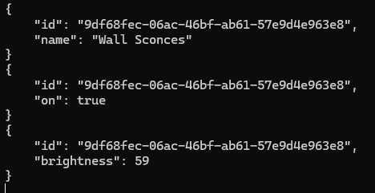

---

### Test 16: Bulk Light Info Change 9
_Change the name, room, on/off status, and brightness of a light._
- [ ]  In the simulator UI, Click "PUT".
- 
- [ ]  Paste the copied value in place of "<id>" on the URL line. See example below.
```http request
/lights/9df68fec-06ac-46bf-ab61-57e9d4e963e8
```
- 
- [ ]  In the simulator UI, copy the json below and pasting into the "Message Body", replacing all contents.
```json
{
  "name": "Office Downlights",
  "room": "Office",
  "on": false, 
  "brightness": 200
}
```
- 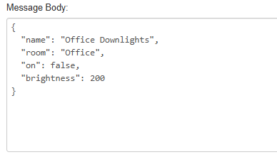
- [ ]  In the simulator UI, click "Send".
- - 
#### EXPECTED RESULTS:
- [ ]  Verify that the simulator reflects the changes to the light. See example below.
```json
{
  "id": "9df68fec-06ac-46bf-ab61-57e9d4e963e8",
  "name": "Office Downlights",
  "room": "Office",
  "on": false,
  "brightness": 200
}
```
- 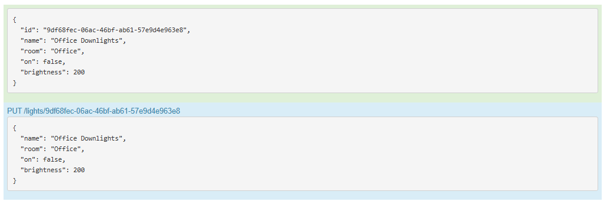
- [ ]  Check that your application terminal correctly updates and displays the new state.
```json
[
  {
    "id": "9df68fec-06ac-46bf-ab61-57e9d4e963e8",
    "name": "Office Downlights"
  },
  {
    "id": "9df68fec-06ac-46bf-ab61-57e9d4e963e8",
    "room": "Office"
  },
  {
    "id": "9df68fec-06ac-46bf-ab61-57e9d4e963e8",
    "on": false
  },
  {
    "id": "9df68fec-06ac-46bf-ab61-57e9d4e963e8",
    "brightness": 78
  }
]
```
- 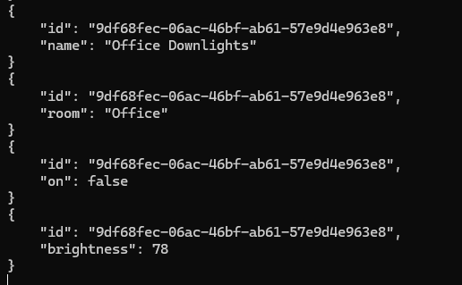

---

### Test 17: Remove a Light
_Remove a light from the existing lights._
- [ ]  Repeat the steps in [Obtain Lights and their states](#obtain-lights-and-their-states) to get a light ID.
- [ ]  In the simulator UI, Click "Remove light".
- 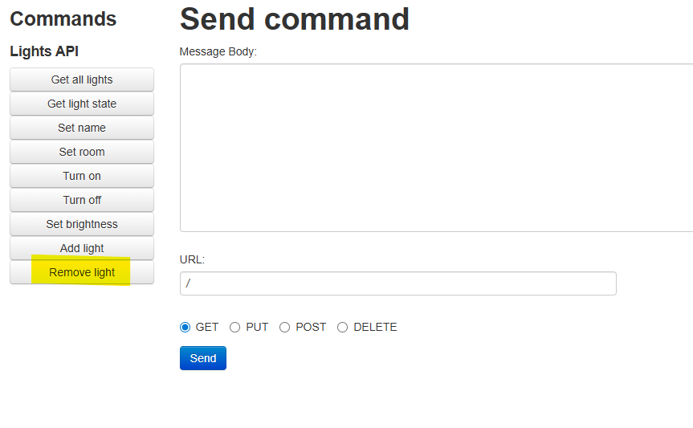
- [ ]  Copy and paste one of the values of the "Bedside Lamp" or "Garage Overhead" in place of "<id>" on the URL line.
- [ ]  In the simulator UI, click "Send".
- 
#### EXPECTED RESULTS:
- [ ]  Verify that the simulator reflects the removal of the target light. See example below.
##### NOTE: Light ID's may vary.
- 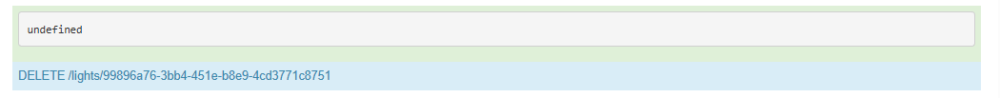
- [ ]  Check that your application terminal correctly updates and displays the new state.
- 

---

### Test 18: Failed Code Challenge Start 1
##### _Starting the Code Challenge Application before the LightSimulator Executable and Light Simulator Browser._
##### _Goal of this test is to show that the program will wait until at least the LightSimulator Executable has been started._
- [ ]  Start a build from Option 1 in [Code Challenge](#code-challenge-execution).
- [ ]  Verify for Option 1 that the output shows at least the following:
- 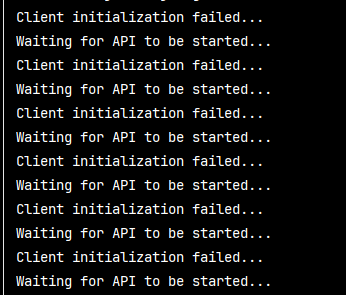
- [ ]  Start a build from Option 2 in [Code Challenge](#code-challenge-execution).
- [ ]  Verify for Option 2 that the output shows at least the following:
- 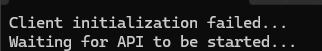
- [ ]  Start the [Light Simulator Executable](#lightsimulator-executable-setup).
- [ ]  Verify that the executable terminal window has opened and started with at least the following below:
- 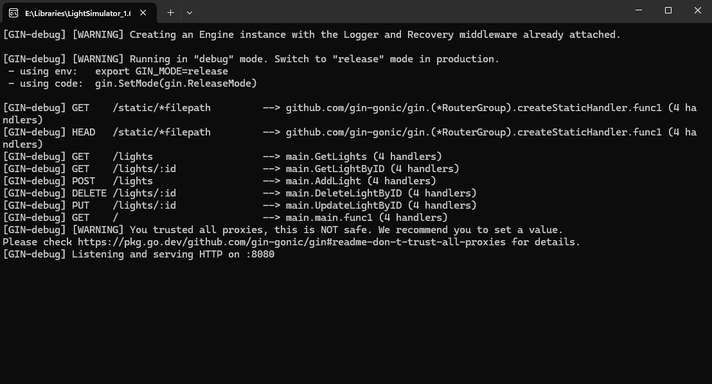
- [ ]  Start the [Light Simulator Browser](#light-simulator-browser-setup).
- [ ]  Verify that the browser simulator starts up correctly.
- 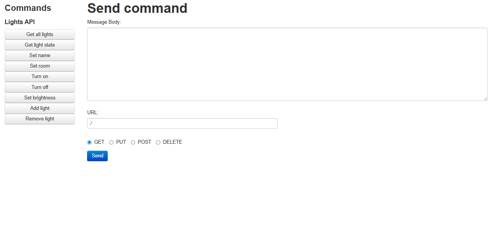
- [ ]  Verify that both options show the initial start output after starting the API.
- 

---

### Test 19: Failed Code Challenge Start 2
##### _Starting the Code Challenge Application with only the Light Simulator Browser running, but not the LightSimulator Executable._
##### _The goal of this test is to show that the program will wait for the API to start even if the browser interface has already been started._
- [ ]  Start the [Light Simulator Browser](#light-simulator-browser-setup).
- [ ] Verify the browser does not actually show the correct start screen:
- 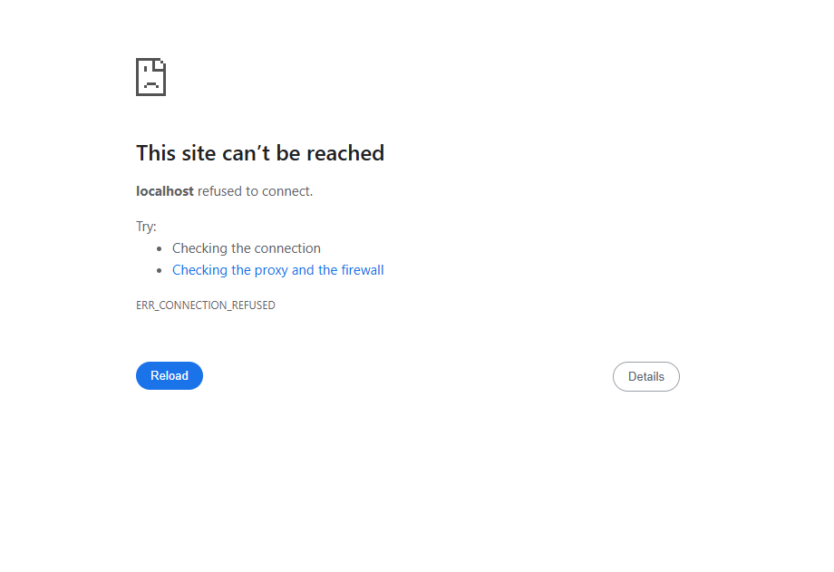
- [ ]  Start a build from Option 1 in [Code Challenge](#code-challenge-execution).
- [ ]  Verify for Option 1 that the output shows at least the following:
- 
- [ ]  Start a build from Option 2 in [Code Challenge](#code-challenge-execution).
- [ ]  Verify for Option 2 that the output shows at least the following:
- 
- [ ]  Start the [Light Simulator Executable](#lightsimulator-executable-setup).
- - [ ]  Verify that the executable terminal window has opened and started with at least the following below:
- 
- [ ]  Verify that both options show the initial start output after starting the API.
- 
- [ ]  Refresh the browser to start the [Light Simulator Browser](#light-simulator-browser-setup).
- [ ]  Verify that the browser simulator starts up correctly.
- 

---

### Test 20: Failed Code Challenge Start 3
##### _Starting the Code Challenge Application with only the LightSimulator Executable running, but not the Light Simulator Browser._
##### _The goal of this test is to demonstrate that the application will start if the API has been started, but that no other outputs will show after start due to the browser interface not being started._
- [ ]  Start the [Light Simulator Executable](#lightsimulator-executable-setup).
- [ ]  Verify that the executable terminal window has opened and started with at least the following below:
- 
- [ ]  Start a build from Option 1 in [Code Challenge](#code-challenge-execution).
- [ ]  Verify for Option 1 that the output shows at least the following:
- 
- [ ]  Start a build from Option 2 in [Code Challenge](#code-challenge-execution).
- - [ ]  Verify for Option 2 that the output shows at least the following:
- 
- - [ ]  Verify that both options show the initial start output after starting the API.
- 
- [ ]  Verify that the browser interface has not been started.
- [ ]  Verify that the light simulator executable is generating non-stop GET commands similar to the image below.
- 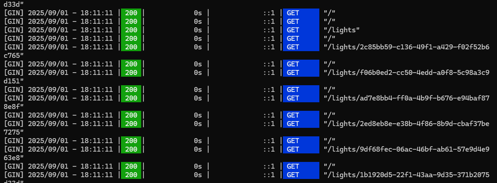
- [ ]  Start the [Light Simulator Browser](#light-simulator-browser-setup).
- [ ]  Verify that the browser simulator starts up correctly.
- 
- [ ]  Verify that the all terminal output have not changed.

---

### Test 21: Failed Code Challenge Running
##### _While the Code Challenge Application, LightSimulator Executable, and the Light Simulator Browser are running, then the LightSimulator Executable only is closed._
##### _The goal of this test is to demonstrate that the application and the light simulator browser both go into an HTTP failed mode state until the API is restarted._
- [ ]  Start the [Light Simulator Executable](#lightsimulator-executable-setup).
- [ ]  Verify that the executable terminal window has opened and started with at least the following below:
- 
- [ ]  Start the [Light Simulator Browser](#light-simulator-browser-setup).
- [ ]  Verify that the browser simulator starts up correctly.
- 
- [ ]  Start a build from Option 1 in [Code Challenge](#code-challenge-execution).
- [ ]  Verify for Option 1 that the output shows at least the following:
- 
- [ ]  Start a build from Option 2 in [Code Challenge](#code-challenge-execution).
- - [ ]  Verify for Option 2 that the output shows at least the following:
- 
- [ ]  Stop the Light Simulator Executable.
- [ ]  Verify that there is not any terminal window open that is running the light simulator executable.
- [ ]  Observe the browser interface and try to issue any commands on the UI.
- 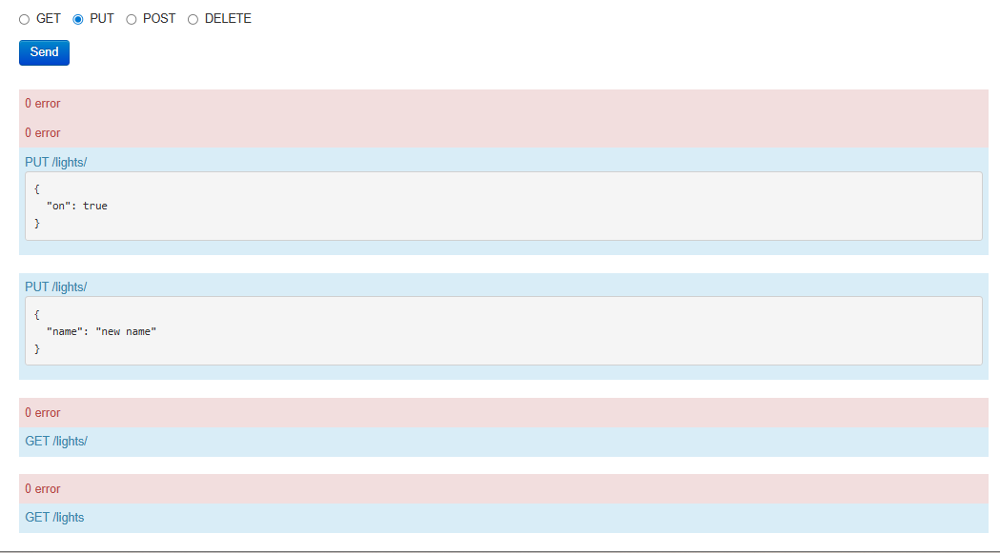
- [ ]  Observe the application output.
- 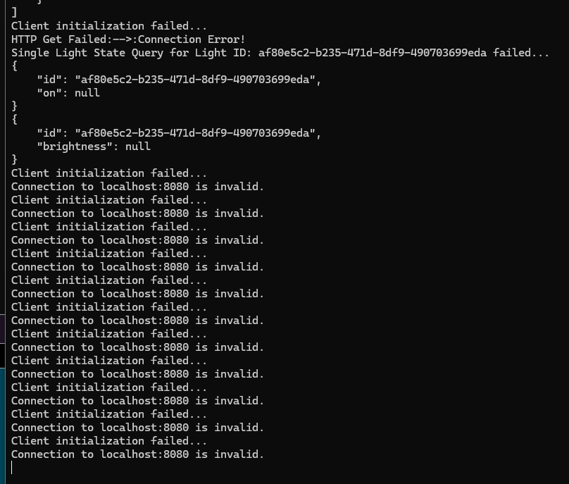
- [ ]  Restart the [Light Simulator Executable](#lightsimulator-executable-setup).
- [ ]  Verify that the executable terminal window has opened and started with at least the following below:
- 
- [ ]  Observe the browser interface and issue any new commands on the UI.
- 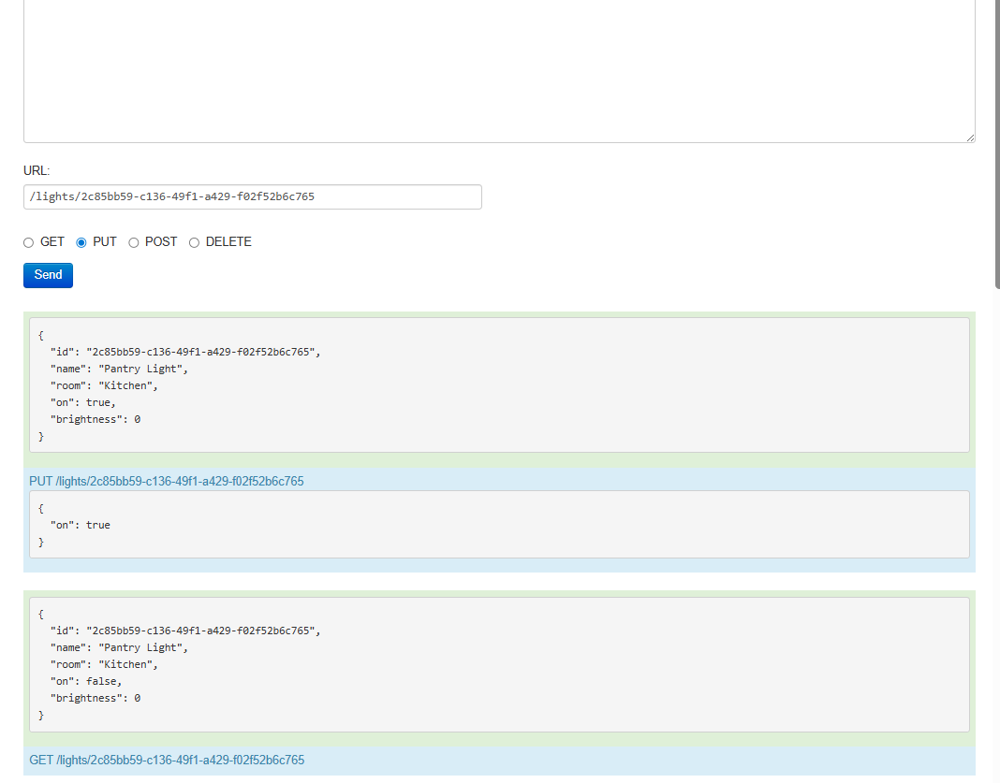
- [ ]  Observe the application output and any new light state changes from commands issued in the browser UI.
- 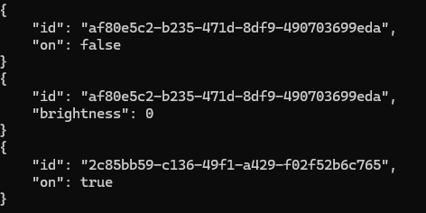

---

**====================================================================================================================**

---

## Feedback

For questions or feedback, please open a GitHub issue on this repository or contact [Cory Jaramillo](https://github.com/coryjaramillo) through your GitHub profile.

---

**====================================================================================================================**

---

## Roadmap

- Add Testing for when new lights are added with incomplete information:
    - Missing Name
    - Missing Room
    - Missing On/Off Status
    - Missing Brightness
    - Missing All

---

**====================================================================================================================**

---

## Related

- [Josh.ai LightSimulator Release v1.0](https://github.com/jstarllc/JoshCodingChallenge/releases/tag/v1.0)
- [JetBrains CLion Documentation](https://www.jetbrains.com/help/clion/)